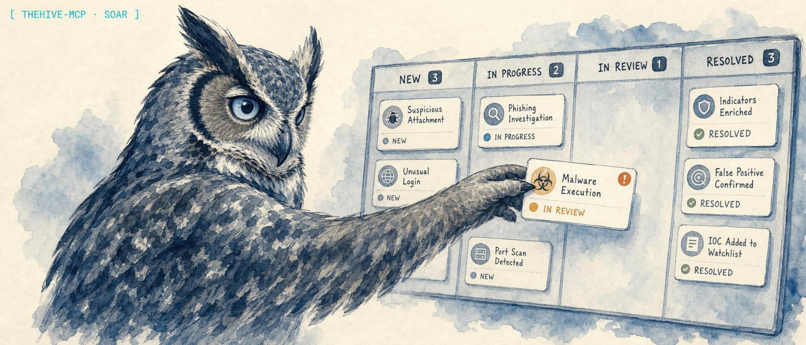

<p align="center">
  
</p>

<h1 align="center">thehive-mcp</h1>

<p align="center">
  <strong>An MCP server that gives an AI client full read-write control of TheHive: cases, alerts, tasks, observables, and Cortex analyzers, over stdio with destructive actions gated off by default.</strong>
</p>

<p align="center">
  <a href="https://www.npmjs.com/package/thehive-mcp"></a>
  <a href="https://github.com/lidless-labs/thehive-mcp/actions/workflows/ci.yml"></a>
  <a href="https://modelcontextprotocol.io/"></a>
  <a href="LICENSE"></a>
</p>

<p align="center">
  <strong>Website: <a href="https://lidless.dev/thehive-mcp">lidless.dev/thehive-mcp</a></strong>
</p>

thehive-mcp is a Model Context Protocol server for [TheHive](https://thehive-project.org/), the open-source security incident response platform. It lets an AI client run the SOC workflow end to end: open and triage cases, promote alerts, track observables, drive tasks, and run Cortex analyzers, all through one stdio process. It differs from a generic REST wrapper because the dangerous verbs (delete, merge, promote, raw query) ship disabled and only turn on behind explicit environment flags, so an agent cannot quietly destroy case data.

## What it does

thehive-mcp is an MCP server for **TheHive** incident response and case management. It exposes 47 Model Context Protocol tools that map onto the full TheHive 5 API surface, so an MCP client (Claude Desktop, Claude Code, Codex CLI, OpenClaw, Hermes, or any other) can drive a security operations center: create and triage cases, manage alerts, add and search observables, run and poll Cortex analyzers, file task logs and comments, and orchestrate SOAR-style incident response workflows in plain language. It talks to your TheHive instance over its REST API and speaks MCP over stdio, so it slots into any agent that supports the protocol with no extra service to run.

The differentiator is safety. Irreversible operations (`thehive_delete_case`, `thehive_delete_alert`, `thehive_merge_cases`, `thehive_promote_alert`) and the raw Query DSL tool are gated off by default and only become callable when you opt in with an environment variable. TLS relaxation is scoped to TheHive requests only, never the whole process. The server is tested against a live **TheHive 5.4.11** instance across read, write, and destructive workflows.

## Quickstart

Run it straight from npm, no global install needed:

```bash
npx -y thehive-mcp
```

Point it at your TheHive instance with two environment variables:

```bash
THEHIVE_URL=https://192.0.2.10:9000 \
THEHIVE_API_KEY=your-api-key \
npx -y thehive-mcp
```

The server speaks MCP over stdio, so it is meant to be launched by an MCP client rather than run by hand. The client config below is the normal entry point.

### MCP client config

Drop this into any MCP client that reads the standard `mcpServers` map (Claude Desktop, Claude Code, and most others use this exact shape):

```json
{
  "mcpServers": {
    "thehive": {
      "command": "npx",
      "args": ["-y", "thehive-mcp"],
      "env": {
        "THEHIVE_URL": "https://192.0.2.10:9000",
        "THEHIVE_API_KEY": "your-api-key"
      }
    }
  }
}
```

To enable the gated destructive tools and the raw Query DSL tool, add them to `env`:

```json
{
  "mcpServers": {
    "thehive": {
      "command": "npx",
      "args": ["-y", "thehive-mcp"],
      "env": {
        "THEHIVE_URL": "https://192.0.2.10:9000",
        "THEHIVE_API_KEY": "your-api-key",
        "THEHIVE_ALLOW_DESTRUCTIVE_TOOLS": "true",
        "THEHIVE_ENABLE_RAW_QUERY": "true"
      }
    }
  }
}
```

For Claude Desktop, the config file lives at `~/Library/Application Support/Claude/claude_desktop_config.json` (macOS) or `%APPDATA%\Claude\claude_desktop_config.json` (Windows). Per-harness instructions (Claude Code, Codex CLI, OpenClaw, Hermes) are in [Client setup](#client-setup) below.

## Configuration

Set environment variables:

| Variable | Required | Default | Description |
|----------|----------|---------|-------------|
| `THEHIVE_URL` | Yes | - | TheHive instance URL using `http` or `https` (e.g. `https://192.0.2.10:9000`) |
| `THEHIVE_API_KEY` | Yes | - | API key for authentication |
| `THEHIVE_VERIFY_SSL` | No | `true` | Set to `false` only for trusted lab systems with self-signed TLS. When disabled, TLS verification is relaxed only for TheHive requests (via a scoped dispatcher), not for the whole process |
| `THEHIVE_TIMEOUT` | No | `30` | Request timeout in seconds (1-300) |
| `THEHIVE_ALLOW_DESTRUCTIVE_TOOLS` | No | `false` | Set to `true` to enable destructive/irreversible MCP tools (`thehive_delete_case`, `thehive_delete_alert`, `thehive_merge_cases`, `thehive_promote_alert`) |
| `THEHIVE_ENABLE_RAW_QUERY` | No | `false` | Set to `true` to enable the raw Query DSL MCP tool |

## Tools

47 tools across cases, alerts, tasks, observables, Cortex, and more. The four destructive tools and the raw query tool are gated behind environment flags as noted.

### Cases (16 tools)

| Tool | Description |
|------|-------------|
| `thehive_list_cases` | List cases with filters (status, severity, tags, owner) |
| `thehive_get_case` | Get a specific case by ID |
| `thehive_create_case` | Create a new case |
| `thehive_update_case` | Update case fields (severity, status, tags, etc.) |
| `thehive_search_cases` | Search cases by title keyword |
| `thehive_close_case` | Close a case with resolution status and summary |
| `thehive_assign_case` | Assign a case to a user |
| `thehive_update_case_custom_fields` | Update case custom fields |
| `thehive_add_case_tags` | Add tags without replacing existing tags |
| `thehive_remove_case_tags` | Remove selected tags |
| `thehive_set_case_flag` | Set or clear the case flag |
| `thehive_bulk_assign_cases` | Assign multiple cases to a user |
| `thehive_bulk_close_cases` | Close multiple cases with the same resolution |
| `thehive_case_timeline_summary` | Summarize case details, tasks, observables, and comments |
| `thehive_delete_case` | Permanently delete a case (with optional force). Requires `THEHIVE_ALLOW_DESTRUCTIVE_TOOLS=true` |
| `thehive_merge_cases` | Merge multiple cases into one (irreversible). Requires `THEHIVE_ALLOW_DESTRUCTIVE_TOOLS=true` |

### Alerts (6 tools)

| Tool | Description |
|------|-------------|
| `thehive_list_alerts` | List alerts with filters (status, severity, source, type) |
| `thehive_get_alert` | Get a specific alert by ID |
| `thehive_create_alert` | Create a new alert |
| `thehive_update_alert` | Update alert fields |
| `thehive_promote_alert` | Promote an alert to a case (creates a new case). Requires `THEHIVE_ALLOW_DESTRUCTIVE_TOOLS=true` |
| `thehive_delete_alert` | Permanently delete an alert. Requires `THEHIVE_ALLOW_DESTRUCTIVE_TOOLS=true` |

### Tasks (4 tools)

| Tool | Description |
|------|-------------|
| `thehive_list_tasks` | List tasks for a case |
| `thehive_get_task` | Get a specific task by ID |
| `thehive_create_task` | Create a task in a case |
| `thehive_update_task` | Update task fields (status, assignee, etc.) |

### Observables (5 tools)

| Tool | Description |
|------|-------------|
| `thehive_list_observables` | List observables for a case |
| `thehive_get_observable` | Get a specific observable by ID |
| `thehive_create_observable` | Add a single observable to a case |
| `thehive_create_observable_bulk` | Add multiple observables of the same type in one request |
| `thehive_search_observables` | Search observables across all cases |

### Task Logs (2 tools)

| Tool | Description |
|------|-------------|
| `thehive_list_task_logs` | List log entries for a task |
| `thehive_create_task_log` | Add a log entry to a task |

### Comments (2 tools)

| Tool | Description |
|------|-------------|
| `thehive_list_comments` | List comments on a case |
| `thehive_create_comment` | Add a comment to a case |

### Users (2 tools)

| Tool | Description |
|------|-------------|
| `thehive_list_users` | List users in the organization |
| `thehive_get_current_user` | Get the authenticated user's profile |

### Cortex (7 tools)

| Tool | Description |
|------|-------------|
| `thehive_list_analyzers` | List available Cortex analyzers |
| `thehive_get_observable_enrichment_options` | List analyzers that can enrich an observable |
| `thehive_run_analyzer` | Run a Cortex analyzer on an observable |
| `thehive_run_analyzer_and_wait` | Run an analyzer and wait for completion |
| `thehive_get_job` | Get analyzer job status and results |
| `thehive_wait_for_job` | Poll a job until it reaches a terminal status |
| `thehive_summarize_job_report` | Return a compact analyzer report summary |

### Query (1 tool)

| Tool | Description |
|------|-------------|
| `thehive_query` | Execute guarded raw TheHive Query DSL for complex searches when enabled with `THEHIVE_ENABLE_RAW_QUERY=true` |

### Templates (1 tool)

| Tool | Description |
|------|-------------|
| `thehive_list_case_templates` | List available case templates |

### Status (1 tool)

| Tool | Description |
|------|-------------|
| `thehive_status` | Get server health, version, and capabilities |

## Prompt Templates

| Prompt | Description |
|--------|-------------|
| `case-summary` | Generate a comprehensive incident case report |
| `alert-triage` | Triage and analyze an alert for escalation |
| `incident-response` | Guided incident response workflow |

## Resources

| Resource | URI | Description |
|----------|-----|-------------|
| Open Cases | `thehive://cases/open` | Currently open cases |
| New Alerts | `thehive://alerts/new` | Unprocessed alerts |
| Current User | `thehive://user/current` | Authenticated user info |

## Client setup

The [MCP client config](#mcp-client-config) above works for any client that reads the standard `mcpServers` map. The notes below cover clients with their own setup command and the source-checkout variant for each.

### Claude Code

```bash
claude mcp add thehive \
  --env THEHIVE_URL=https://192.0.2.10:9000 \
  --env THEHIVE_API_KEY=your-api-key \
  -- npx -y thehive-mcp
```

Add `--scope user` to make it available from any directory instead of only the current project.

### Codex CLI

[Codex CLI](https://github.com/openai/codex) registers MCP servers via `codex mcp add`:

```bash
codex mcp add thehive \
  --env THEHIVE_URL=https://192.0.2.10:9000 \
  --env THEHIVE_API_KEY=your-api-key \
  -- npx -y thehive-mcp
```

Codex writes the entry to `~/.codex/config.toml` under `[mcp_servers.thehive]`. Verify with `codex mcp list`.

### OpenClaw

```bash
openclaw mcp set thehive '{
  "command": "npx",
  "args": ["-y", "thehive-mcp"],
  "env": {
    "THEHIVE_URL": "https://192.0.2.10:9000",
    "THEHIVE_API_KEY": "your-api-key"
  }
}'
```

Then restart the gateway and confirm registration:

```bash
systemctl --user restart openclaw-gateway
openclaw mcp list
```

### Hermes Agent

[Hermes Agent](https://github.com/NousResearch/hermes-agent) reads MCP config from `~/.hermes/config.yaml` under the `mcp_servers` key:

```yaml
mcp_servers:
  thehive:
    command: "npx"
    args: ["-y", "thehive-mcp"]
    env:
      THEHIVE_URL: "https://192.0.2.10:9000"
      THEHIVE_API_KEY: "your-api-key"
```

Then reload MCP from inside a Hermes session with `/reload-mcp`.

### Source checkout

If you run from a source checkout instead of the npm package, point `command`/`args` at the built `dist/index.js`:

```json
{
  "command": "node",
  "args": ["/absolute/path/to/thehive-mcp/dist/index.js"]
}
```

## Why not the TheHive REST API directly?

You can, and for a script you should. The REST API is the right tool when you already know exactly which endpoint you want. thehive-mcp exists for the case where an AI agent is doing the deciding: it turns the API into 47 named, typed, described tools an MCP client can pick from in natural language, handles the TheHive 5 quirks (204 PATCH responses, array-shaped observable creation, connector endpoints under `/api/connector/`), and puts safety rails in front of the irreversible verbs so a model cannot delete or merge case data unless you explicitly opted in. A raw HTTP client gives you none of that.

## Why not a generic OpenAPI-to-MCP bridge?

A generic bridge exposes every endpoint flat, with no notion of which calls are dangerous and no awareness of TheHive 5's behavioral edges. thehive-mcp is hand-built for TheHive: destructive tools are gated, the raw Query DSL is gated and shape-checked, TLS relaxation is scoped to TheHive requests only, sensitive values are redacted from error output, and the tool descriptions carry the correct TheHive 5 status enums (TruePositive, FalsePositive, and so on, not the old "Resolved"). Those are decisions a generic bridge cannot make for you.

## What thehive-mcp is not

- It is not a replacement for TheHive. You need a running TheHive 5 instance and a valid API key; this server only talks to one.
- It is not a hosted service or daemon. It is a stdio process your MCP client launches on demand. Nothing listens on a port and nothing phones home.
- It is not a Cortex server. It drives Cortex analyzers through TheHive's connector, but analyzer execution happens in your own Cortex deployment. For a dedicated Cortex MCP server, see [cortex-mcp](https://lidless.dev/cortex-mcp).
- It is not safe-by-omission. Destructive tools exist; they are gated, not removed. Turning on `THEHIVE_ALLOW_DESTRUCTIVE_TOOLS` hands an agent the ability to delete and merge real case data.

## TheHive 5 notes

- **Organizations matter.** The `admin` org only has platform permissions. Create a separate org (e.g. "SOC") with an `org-admin` user for full case/alert/task/observable access.
- **Case statuses changed in v5.** Closed statuses are: TruePositive, FalsePositive, Indeterminate, Duplicated, Other. There is no "Resolved" status.
- **PATCH returns 204.** Update operations return no body; the client re-fetches the entity automatically.
- **Observable creation returns arrays.** The client handles this transparently. Bulk creation uses `data` as an array.
- **Cortex connector endpoints** live under `/api/connector/` not `/api/v1/`.
- **`description` is required** when creating cases and alerts.
- **Destructive MCP tools are gated.** `thehive_delete_case`, `thehive_delete_alert`, `thehive_merge_cases` (irreversible), and `thehive_promote_alert` require `THEHIVE_ALLOW_DESTRUCTIVE_TOOLS=true`.
- **Raw query is gated.** `thehive_query` requires `THEHIVE_ENABLE_RAW_QUERY=true`.
- **SSL verification is scoped.** Setting `THEHIVE_VERIFY_SSL=false` relaxes TLS certificate validation only for requests to TheHive (via a per-client undici dispatcher) and never disables it process-wide. A warning is logged to stderr when enabled.

## Development

```bash
# Install dependencies
npm install

# Build
npm run build

# Run tests
npm test

# Run read-only live integration tests (skips when env vars are missing)
THEHIVE_URL=https://192.0.2.10:9000 THEHIVE_API_KEY=your-key npx tsx scripts/live-test.ts

# Run live write tests
THEHIVE_URL=https://192.0.2.10:9000 THEHIVE_API_KEY=your-key THEHIVE_LIVE_ALLOW_WRITES=true npx tsx scripts/live-test.ts

# Run live write tests with destructive cleanup, deletes, and merge checks
THEHIVE_URL=https://192.0.2.10:9000 THEHIVE_API_KEY=your-key THEHIVE_LIVE_ALLOW_WRITES=true THEHIVE_LIVE_ALLOW_DESTRUCTIVE=true npx tsx scripts/live-test.ts

# Type check
npm run typecheck

# Development mode
THEHIVE_URL=https://192.0.2.10:9000 THEHIVE_API_KEY=your-key npm run dev
```

## Contributing

Bug reports and patches are welcome. See [CONTRIBUTING.md](CONTRIBUTING.md) for what lands easily, [SECURITY.md](SECURITY.md) for reporting vulnerabilities, and [CODE_OF_CONDUCT.md](CODE_OF_CONDUCT.md). Issue templates are under [.github/ISSUE_TEMPLATE](.github/ISSUE_TEMPLATE).

## License

[MIT](LICENSE)
</content>
